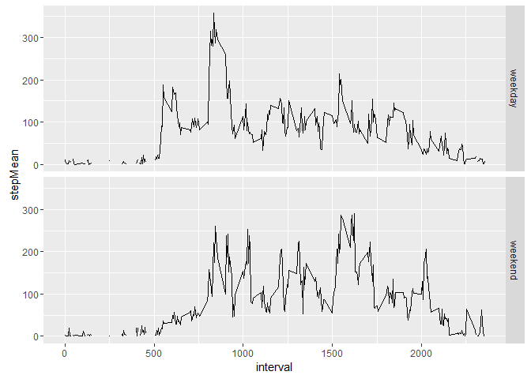

# Reproducible Research: Peer Assessment 1

## Loading required libraries

```r
library(dplyr)
```

```
## 
## Attaching package: 'dplyr'
```

```
## The following objects are masked from 'package:stats':
## 
##     filter, lag
```

```
## The following objects are masked from 'package:base':
## 
##     intersect, setdiff, setequal, union
```

```r
library(ggplot2)
library(lubridate)
library(data.table)
```

```
## 
## Attaching package: 'data.table'
```

```
## The following objects are masked from 'package:lubridate':
## 
##     hour, mday, month, quarter, wday, week, yday, year
```

```
## The following objects are masked from 'package:dplyr':
## 
##     between, last
```

```r
library(reshape2)
```

```
## 
## Attaching package: 'reshape2'
```

```
## The following objects are masked from 'package:data.table':
## 
##     dcast, melt
```

```r
#library(zoo)
```


## Loading and preprocessing the data

```r
setwd("C:/Users/R/OneDrive/coursera/reproducibleResearch/week1Assignment")

#if(!exists("activity")){
   # unzip("activity.zip")
  activity<- read.csv("activity.csv")
#}

activity$date<-ymd(as.character(activity$date))
```


## What is mean total number of steps taken per day? 
First see a histogram which shows the day totals of steps, then see a time serie showing the mean and medium of each day. For calculating the day mean and median I ignored values of 0, not stepping should not affect stepping averages I assumed.

```r
activityByDay<- group_by(activity[,c(1:2)],date) %>%summarise(median(steps[steps>0]),
                                                              mean(steps[steps>0]),
                                                              sum(steps))

names(activityByDay)<-c("date","steps-Median","steps-Mean","steps")

totalStepsaDay <- ggplot(activityByDay, aes(x=date, weights=steps)) + 
  geom_bar()+labs(y="total of steps a day")
print(totalStepsaDay)
```


```r
#easy way of plotting two lines into one diagram is by using melt of reshape library
activityByDay.melt<- melt(activityByDay[,c(1:3)], id.vars="date",variable.name ="Aggregate", value.name="steps")

#plotting mean and median in one diagram
MeanAndMediumADay <-ggplot(data=activityByDay.melt,aes(date,steps,col=Aggregate)) + geom_point(alpha=0.3) + scale_color_manual(values = c("steps-Mean" = 'red','steps-Median' = 'blue')) 
   
print(MeanAndMediumADay)
```

```
## Warning: Removed 16 rows containing missing values (geom_point).
```


## What is the average daily activity pattern?
See below the time serie of the interval averages over all days.

```r
activityByInterval<- group_by(activity[,-2],interval) %>%summarise(mean(steps[steps>0],na.rm=TRUE))
names(activityByInterval)<- c("interval", "stepMean")
 
IntervalMean <- ggplot(data=activityByInterval,aes(x=interval,y=stepMean)) + geom_point(alpha=.3)
print(IntervalMean)
```

```
## Warning: Removed 19 rows containing missing values (geom_point).
```


```r
maxInterval <- filter(activityByInterval,stepMean==max(activityByInterval$stepMean, na.rm = TRUE))
maxInterval
```

```
## Source: local data frame [1 x 2]
## 
##   interval stepMean
##      (int)    (dbl)
## 1      835 352.4839
```


## Imputing missing values  
First I tried for replace Na's with the function "na.locf" of the zoo package, it replaces a na with a nearest value,  
which most of the time is a 0, so not good, finally I used the suggested solution from the instruction,  
replace a NA in a day for a mean of that day. I had some inspiration from slashdot ([link  to slashdot resource ](http://stackoverflow.com/questions/9322773/how-to-replace-na-with-mean-by-subset-in-r-impute-with-plyr)).    
  
Eyeballing the figures I couldn't see a difference after replacing the NA, but when calculating the means of the totals of the data frame with NA and from the data frame with NA I could see a slight difference, around 1%.

```r
NumberOfNA <- sum(is.na(activity$steps))
NumberOfNA
```

```
## [1] 2304
```

```r
# na.locf replaces NA with nearest which is 0 most of the time, not good, changed to manual

#replacing NA with Mean of the day
impute.mean <- function(x) replace(x, is.na(x), mean(x, na.rm = TRUE))
activity<- group_by(activity,date) %>%mutate(steps =impute.mean(steps))
NumberOfNA_afterReplacement <- sum(is.na(activity$steps))
NumberOfNA_afterReplacement
```

```
## [1] 2592
```

```r
#create total a day aggregates with NA replaced
activityByDayNoNA<- group_by(activity[,c(1:2)],date) %>% summarise(median(steps[steps>0]),
                                                              mean(steps[steps>0]),
                                                              sum(steps))

names(activityByDayNoNA)<-c("date","steps-Median2","steps-Mean2","steps2")

#plotting histogram of data with NA replaced
totalStepsaDay <- ggplot(activityByDayNoNA, aes(x=date, weights=steps2)) + 
  geom_bar()+labs(y="total of steps a day")
print(totalStepsaDay)
```


```r
#easy way of plotting two lines into one diagram is by using melt of reshape library
activityByDayNoNA.melt<- melt(activityByDayNoNA[,c(1:3)], id.vars="date",variable.name ="Aggregate", value.name="steps2")

#plotting two time lines with NA replaced
MeanAndMediumADay <-ggplot(data=activityByDayNoNA.melt,aes(date,steps2,col=Aggregate)) + geom_point(alpha=0.3) + scale_color_manual(values = c("steps-Mean2" = 'red','steps-Median2' = 'blue')) 
print(MeanAndMediumADay)
```

```
## Warning: Removed 18 rows containing missing values (geom_point).
```


```r
#show mean of median per day, mean of mean per day, mean of sum per day for data frame with and without NA
# clearly the influence is minimal, less than 1%
averages_With_Na_replaced<-summarise_each(activityByDayNoNA[complete.cases(activityByDayNoNA),][,c(-1)],funs(mean))
averages_With_Na_not_replaced<-summarise_each(activityByDay[complete.cases(activityByDay),][,c(-1)],funs(mean))
averages_With_Na_not_replaced
```

```
## Source: local data frame [1 x 3]
## 
##   steps-Median steps-Mean    steps
##          (dbl)      (dbl)    (dbl)
## 1      56.5566   129.7411 10766.19
```

```r
averages_With_Na_replaced
```

```
## Source: local data frame [1 x 3]
## 
##   steps-Median2 steps-Mean2   steps2
##           (dbl)       (dbl)    (dbl)
## 1      56.47115     129.541 10754.92
```


## Are there differences in activity patterns between weekdays and weekends?
See below the two time series of steps during weekdays and steps during weekends,  
there is more activity(more steps) early in the day during weekdays than during weekends and  
later in the day there is more activity during weekends than during weekdays.

```r
#add factor
isweekend<-ifelse(wday(activity$date) %in% c(7,1),1,0)
activity$kindOfDay<-factor(isweekend,levels = c(0,1),labels=c("weekday","weekend"))

#create data frame interval over weekdays
weekdayActivityByInterval <- filter(activity,kindOfDay=="weekday")
weekdayActivityByInterval<- group_by(weekdayActivityByInterval[,-2],interval) %>%summarise(mean(steps[steps>0],na.rm=TRUE),first(kindOfDay))
names(weekdayActivityByInterval)<- c("interval", "stepMean","kindOfDay")

#create data frame interval over weekends
weekendActivityByInterval <- filter(activity,kindOfDay=="weekend")
weekendActivityByInterval<- group_by(weekendActivityByInterval[,-2],interval) %>%summarise(mean(steps[steps>0],na.rm=TRUE),first(kindOfDay))
names(weekendActivityByInterval)<- c("interval", "stepMean","kindOfDay")

#merge weekdays and weekends data frames
weekActivityByInterval <-rbind(weekendActivityByInterval,weekdayActivityByInterval)

#plotting
dayIntervalMean <- ggplot(data=weekActivityByInterval,aes(x=interval,y=stepMean)) + geom_line()  +
                  facet_grid(kindOfDay ~ .)
print(dayIntervalMean)
```

```
## Warning: Removed 2 rows containing missing values (geom_path).
```


