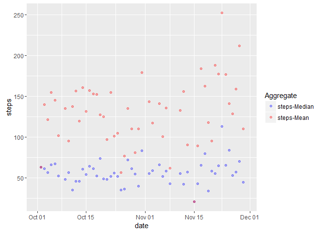

# Reproducible Research: Peer Assessment 1

## Loading required libraries

```r
library(dplyr)
```

```
## 
## Attaching package: 'dplyr'
```

```
## The following objects are masked from 'package:stats':
## 
##     filter, lag
```

```
## The following objects are masked from 'package:base':
## 
##     intersect, setdiff, setequal, union
```

```r
library(ggplot2)
library(lubridate)
library(data.table)
```

```
## 
## Attaching package: 'data.table'
```

```
## The following objects are masked from 'package:lubridate':
## 
##     hour, mday, month, quarter, wday, week, yday, year
```

```
## The following objects are masked from 'package:dplyr':
## 
##     between, last
```

```r
library(reshape2)
```

```
## 
## Attaching package: 'reshape2'
```

```
## The following objects are masked from 'package:data.table':
## 
##     dcast, melt
```


## Loading and preprocessing the data

```r
setwd("C:/Users/R/OneDrive/coursera/reproducibleResearch/week1Assignment")

if(!exists("activity")){
   # unzip("activity.zip")
  activity<- read.csv("activity.csv")
}
activity<-activity[complete.cases(activity),]
activity$date<-ymd(as.character(activity$date))
```


## What is mean total number of steps taken per day?

```r
activityByDay<-activity[complete.cases(activity),]
activityByDay<- group_by(activity[,c(1:2)],date) %>%summarise(sum(steps,na.rm = TRUE),
                                                              mean(steps[steps>0],na.rm = TRUE),
                                                              median(steps[steps>0],na.rm=TRUE))

names(activityByDay)<-c("date","steps","stepsMean","stepsMedian")

totalStepsaDay <- ggplot(activityByDay, aes(x=date, weights=steps)) + 
  geom_bar()+labs(y="total of steps a day")
print(totalStepsaDay)
```


```r
#activityByDay.melt<- melt(activityByDay, id.vars="date", variable.name = "aggregate", value.name = "Steps"

MeanAndMediumADay <-ggplot(data=activityByDay,aes(date,stepsMean)) + geom_point(alpha=.4,color="red") +
                     geom_point(aes(date,stepsMedian),alpha=.3,color="blue") + labs(y="steps") 
   
                   
print(MeanAndMediumADay)
```




## What is the average daily activity pattern?


## Imputing missing values


## Are there differences in activity patterns between weekdays and weekends?
