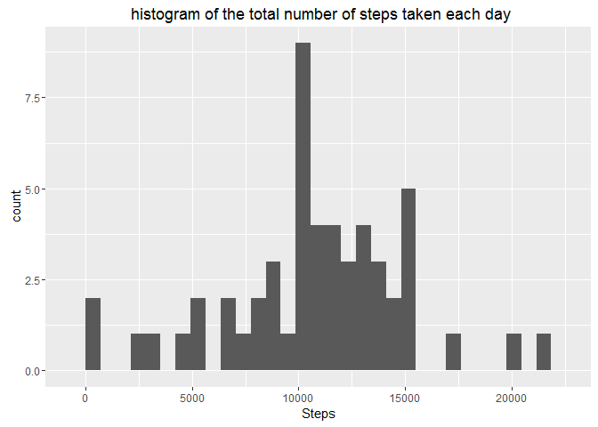
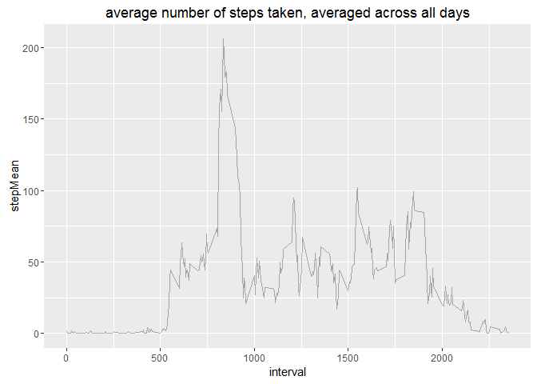

# Reproducible Research: Peer Assessment 1

## Loading required libraries

```r
library(dplyr)
```

```
## 
## Attaching package: 'dplyr'
```

```
## The following objects are masked from 'package:stats':
## 
##     filter, lag
```

```
## The following objects are masked from 'package:base':
## 
##     intersect, setdiff, setequal, union
```

```r
library(ggplot2)
library(lubridate)
library(data.table)
```

```
## 
## Attaching package: 'data.table'
```

```
## The following objects are masked from 'package:lubridate':
## 
##     hour, mday, month, quarter, wday, week, yday, year
```

```
## The following objects are masked from 'package:dplyr':
## 
##     between, last
```

```r
library(reshape2)
```

```
## 
## Attaching package: 'reshape2'
```

```
## The following objects are masked from 'package:data.table':
## 
##     dcast, melt
```


## Loading and preprocessing the data

```r
setwd("C:/Users/R/OneDrive/coursera/reproducibleResearch/week1Assignment")

if(!exists("activity")){
   # unzip("activity.zip")
  activity<- read.csv("activity.csv")
}

activity$date<-ymd(as.character(activity$date))
```


## What is mean total number of steps taken per day?  
(ignored for median and mean values of 0)

```r
activityByDay<- group_by(activity[,c(1:2)],date) %>%summarise(median(steps[steps>0]),
                                                              mean(steps[steps>0]),
                                                              sum(steps))

names(activityByDay)<-c("date","steps-Mean","steps-Median","steps")

totalStepsaDay <- ggplot(activityByDay, aes(x=date, weights=steps)) + 
  geom_bar()+labs(y="total of steps a day")
print(totalStepsaDay)
```



```r
activityByDay.melt<- melt(activityByDay[,c(1:3)], id.vars="date",variable.name ="Aggregate", value.name="steps")

MeanAndMediumADay <-ggplot(data=activityByDay.melt,aes(date,steps,col=Aggregate)) + geom_point(alpha=0.3) + scale_color_manual(values = c("steps-Mean" = 'red','steps-Median' = 'blue')) 
   
print(MeanAndMediumADay)
```


## What is the average daily activity pattern?

```r
activityByInterval<- group_by(activity[,-2],interval) %>%summarise(mean(steps[steps>0],na.rm=TRUE))
names(activityByInterval)<- c("interval", "stepMean")
 
IntervalMean <- ggplot(data=activityByInterval,aes(x=interval,y=stepMean)) + geom_point(alpha=.3)
print(IntervalMean)
```

```
## Warning: Removed 19 rows containing missing values (geom_point).
```



```r
maxInterval <- filter(activityByInterval,stepMean==max(activityByInterval$stepMean, na.rm = TRUE))
maxInterval
```

```
## Source: local data frame [1 x 2]
## 
##   interval stepMean
##      (int)    (dbl)
## 1      835 352.4839
```


## Imputing missing values

```r
NumberOfNA <- sum(is.na(activity$steps))
datesNa<- sum(is.na(activity$date))

NumberOfNA
```

```
## [1] 2304
```

```r
datesNa
```

```
## [1] 0
```


## Are there differences in activity patterns between weekdays and weekends?
